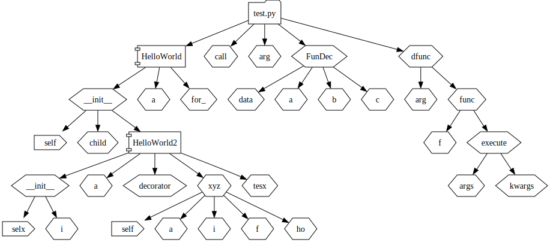

# lexz
Remapping Variable Using Abstract Syntax Tree [(AST)](https://docs.python.org/3/library/ast.html) 
# Tutorial
### Generate GraphViz File
```bash
python -m lexz -f test.py -g graph.dot
```
### Generate SVG Image
```bash
python -m lexz test.py -g graph.dot
dot -Tsvg output.svg graph.dot

#in single line
 python -m lexz -f test.py -g /dev/stdout|dot -Tsvg -o output.svg
```
# Demo
### Input

```python
class HelloWorld:
    def __init__(self) -> None:
        try:
            self.a = 3
        except Exception:
            self.b = 3

        class HelloWorld2((child:=HelloWorld)):
            def __init__(selx) -> None:
                selx.a = 3
                for i in range(10):
                    self.for_ = i
            @dfunc((decorator:=10))
            async def xyz(self, a):
                async for i in range(10):
                    self.tesx = i
                async with open("test3.py", "r") as f:
                    print(f.read())
                lambda ho: 123

@(lambda:(call:=dfunc((arg:=2))))()
def FunDec():
    data ={'a': (a:=(b:=(c:=3)))}
    pass

def dfunc(arg):
    def func(f):
        def execute(*args, **kwargs):
            return f(*args, **kwargs)
        return execute
    return func

```

### Result Graphviz( Dot Graph )

